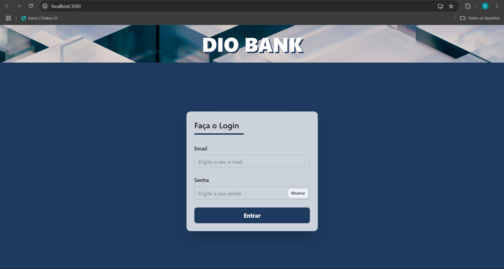

### Desafios
[ ok ] Crie os componentes referentes aos elementos na página inicial

[ ok ] Crie um componente para o header, com o título da aplicação
Crie um componente para o botão, que aceite onClick como uma das props do componente
[ ok ] Refatore o componente Card para receber o formulário de login. Ao invés de chamar elemento por elemento na página inicial, apenas o componente Card deve ser chamado.
[ ok ] Crie uma função de Boas vindas

[ ok ] Clicar no botão, deve aparecer um alert com uma mensagem de boas vindas
Crie o teste unitário da função

### Certificados de conclusão dos cursos

- [Introdução ao React com Typescript](https://www.dio.me/certificate/9Q0PIIEV/share)
- [Criando Páginas com React e TypeScript](https://www.dio.me/certificate/UKYSFMSK/share)

### Demonstração da tela criada

